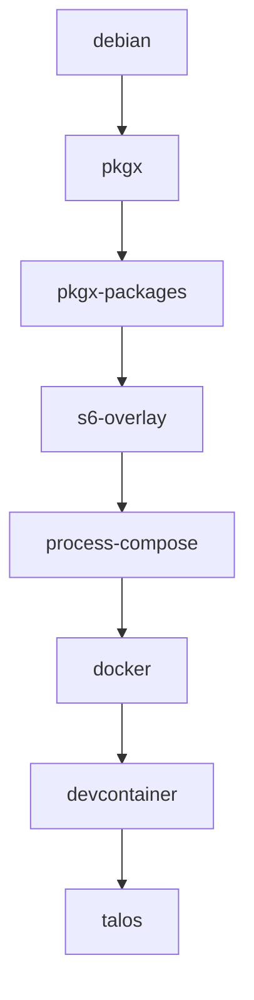

Open this repository in a GitHub Codespace with a click on the badge below.

[](https://github.com/codespaces/new?hide_repo_select=true&ref=main&repo=1051278938&skip_quickstart=true&machine=standardLinux32gb&devcontainer_path=.devcontainer%2Ftalos%2Fdevcontainer.json&geo=EuropeWest)

## 

## Todo

* https://github.com/bahdotsh/wrkflw
  * alternative: `act`
  * see: https://github.com/nektos/act
  * vscode: https://sanjulaganepola.github.io/github-local-actions-docs/
* PostgreSQL
  * install proxysql
  * add postgres server(s)
* Node
  * add oxlint / oxc
    * https://oxc.rs/blog/2025-08-17-oxlint-type-aware.html
* lazygit
  * add custom keybindings (conventional commits, pick JIRA ticket, ...)
  * see: https://github.com/jesseduffield/lazygit/blob/master/docs/Custom_Command_Keybindings.md
* kubernetes
  * add kubectl-node-shell
  * see: https://github.com/kvaps/kubectl-node-shell
  * on Talos: https://github.com/kvaps/kubectl-node-shell?tab=readme-ov-file#x-mode
* ai/mcp
  * mcp-kubernetes
    * see: https://github.com/Azure/mcp-kubernetes
  * kubectl ai
  * docker mcp gateway
  * cli
    * opencode
      * see: https://opencode.ai/docs
    * auggy
      * see: https://docs.augmentcode.com/cli/overview

## Build Order



## Pulumi

```bash
bun install
pulumi login
pulumi up
pulumi stack output --json
pulumi destroy

## stack topology
pulumi stack graph pulumi-stack-dev.dot --stack=dev
## output as png with graphviz
pulumi stack graph /dev/stdout --stack=dev | dot -T 'png' -o 'pulumi-stack-dev.png'

## interactive stack selection
pulumi stack select "$(pulumi stack ls --non-interactive --fully-qualify-stack-names --json | jq -r '.[].name' | fzf)"
```

## Hetzner Cloud

* Pulumi: [HCloud Provider](https://www.pulumi.com/registry/packages/hcloud/)
* https://github.com/apricote/hcloud-upload-image

## Talos

* pulumi + example: https://github.com/spigell/pulumi-hcloud-kube-hetzner

```bash
## show cluster members
talosctl --talosconfig talosconfig -n  $(pulumi stack output --json  | jq '.cluster.controlPlane.ipv4') get members
```

## GitHub Tokens

We can not use fine-grained personal access tokens starting with `github_pat_*` to authenticate with the Docker registry `ghcr.io`.

## Pocket ID

* see: https://pocket-id.org/docs/setup/installation
* talos tutorial: https://documentation.breadnet.co.uk/kubernetes/oidc/talos-oidc-pocket-id/
* install: https://github.com/int128/kubelogin

## Atuin

```bash
ATUIN_CONFIG_DIR=/etc/xdg/atuin
ATUIN_THEME_DIR=/opt/atuin/themes

## data
export ATUIN_RECORD_STORE_PATH=/opt/atuin/data/atuin_records.db
export ATUIN_DB_PATH=/opt/atuin/data/atuin.db
export ATUIN_KV__DB_PATH=/opt/atuin/data/atuin_kv.db
export ATUIN_SCRIPTS__DB_PATH=/opt/atuin/data/atuin_scripts.db

## set to a non-empty value to disable keybindings
ATUIN_NOBIND="true"
```

```bash
## does "atuin status" return non-zero exit code if not logged in?
atuin status

## does "atuin account verify" exit with non-zero exit code if not logged in?
atuin account verify

## note: "atuin login" exists with non-zero exit code 1 if already logged in
atuin login \
  --username=="${ATUIN_USERNAME:?}" \
  --password=="${ATUIN_PASSWORD:?}" \
  --key="${ATUIN_KEY:?}"
atuin store pull --force
```

```bash
atuin dotfiles alias list
```

```
Dotfiles are not enabled. Add

[dotfiles]
enabled = true

to your configuration file to enable them.

The default configuration file is located at ~/.config/atuin/config.toml.
```

## VSCode plugins to evaluate

* https://github.com/larsniet/s3x-explorer

## krew plugins

* https://github.com/ahmetb/kubectl-tree

## Git

```bash
GIT_AUTHOR_NAME="Alice Example"
GIT_AUTHOR_EMAIL="alice@example.com"
GIT_COMMITTER_NAME="Bob Committer"
GIT_COMMITTER_EMAIL="bob@example.com"
```

Clear vars in Atuin

```bash
echo GIT_{AUTHOR,COMMITTER}_{NAME,EMAIL} \
| xargs -n1 atuin dotfiles var delete
```

Set vars in Atuin

```bash
atuin dotfiles var set GIT_AUTHOR_NAME '"Nicolai Fröhlich"'
!!:s/AUTHOR/COMMITTER/
atuin dotfiles var set GIT_AUTHOR_EMAIL '"nifr@users.noreply.github.com"'
!!:s/AUTHOR/COMMITTER/
```

Show Alias

```bash
atuin dotfiles alias set alias-test 'echo GIT_AUTHOR_EMAIL="${GIT_AUTHOR_EMAIL}"'
```

Test Atuin integration (restart shell before)

```bash
env | grep -E '^GIT_(AUTHOR|COMMITTER)'
alias-test
```

## Git Commit Signing with SSH Keys

* add a SSH signing key here: https://github.com/settings/ssh/new


Setup GPG Signing - equivalent to:

```bash
GIT_CONFIG_COUNT='4'
GIT_CONFIG_KEY_0='gpg.format'
GIT_CONFIG_VALUE_0='ssh'
GIT_CONFIG_KEY_1='commit.gpgsign'
GIT_CONFIG_VALUE_1='true'
GIT_CONFIG_KEY_2='tag.gpgsign'
GIT_CONFIG_VALUE_2='true'
GIT_CONFIG_KEY_3='user.signingkey'
GIT_CONFIG_VALUE_3='ssh-ed25519 AAAAC3Nz...abcd nifr@machine'
```

With Atuin you'd set:

Note the weird quoting to include a literal `'` in the export.

```bash
atuin dotfiles var set GIT_CONFIG_COUNT   "'"'4'"'"
atuin dotfiles var set GIT_CONFIG_KEY_0   "'"'gpg.format'"'"
atuin dotfiles var set GIT_CONFIG_VALUE_0 "'"'ssh'"'"
atuin dotfiles var set GIT_CONFIG_KEY_1   "'"'commit.gpgsign'"'"
atuin dotfiles var set GIT_CONFIG_VALUE_1 "'"'true'"'"
atuin dotfiles var set GIT_CONFIG_KEY_2   "'"'tag.gpgsign'"'"
atuin dotfiles var set GIT_CONFIG_VALUE_2 "'"'true'"'"
atuin dotfiles var set GIT_CONFIG_KEY_3   "'"'user.signingkey'"'"
atuin dotfiles var set GIT_CONFIG_VALUE_3 "'"'key::ssh-ed25519 AAAAC3NzaC1lZDI1NTE5AAAAIIc7p5w0eyCsU9efHTf4htNZKwMR7/GGshkU6B/PRQMr'"'"
```

VSCode has issues with SSH key signing

enable: `"git.enableCommitSigning": true`

* see: https://github.com/microsoft/vscode/issues/159584
* see: https://github.com/microsoft/vscode/issues/179517

Get the base64 blob public key from the GitHub API:

```bash
curl -sLo- 'https://github.com/nifr.keys' \
  | grep -E '^ssh-ed25519' \
  | tail -1 \
  | sed -E 's/^ssh-ed25519[[:space:]]+([^[:space:]]+).*$/\1/'
```

Verify with:

```bash
atuin dotfiles var list
```

Get personal commit e-mail

```bash
curl -H "Authorization: Bearer $GH_TOKEN" \
     -H "Accept: application/vnd.github+json" \
     https://api.github.com/user/emails
```

Not possible with a fine-grained token (begins with `github_pat_*`). Requires `user:email` scope.

```json
{
  "message": "Resource not accessible by personal access token",
  "documentation_url": "https://docs.github.com/rest/users/emails#list-email-addresses-for-the-authenticated-user",
  "status": "403"
}
```

## GitHub CLI Extensions

Requires a shim to install globally.

see: https://github.com/cli/cli/issues/4267

```bash
gh extension install dlvhdr/gh-dash
```

## Devcontainer / Codespaces Detection

Containers started by `Open in Devcontainer` have the following environment variables

```bash
REMOTE_CONTAINERS=true
REMOTE_CONTAINERS_IPC=/tmp/vscode-remote-containers-ipc-b1d13d61-bd92-4c4c-8cbb-ae2fd994ae0e.sock
REMOTE_CONTAINERS_SOCKETS=["/tmp/vscode-ssh-auth-b1d13d61-bd92-4c4c-8cbb-ae2fd994ae0e.sock","/root/.gnupg/S.gpg-agent"]
```

Other env vars set by VSCode include the integrated Terminal

```bash
TERM_PROGRAM=vscode
```

Environment variable `VSCODE_NONCE` which is used by the Integrated terminal's shell integration:

```bash
VSCODE_NONCE=b922a274-11a4-447f-afef-6893b24e4c47
```

The `BROWSER` variable that proxies `xdg-open` calls to the local browser

```bash
BROWSER=/vscode/vscode-server/bin/linux-arm64/f220831ea2d946c0dcb0f3eaa480eb435a2c1260/bin/helpers/browser.sh
```

```
SSH_AUTH_SOCK=/tmp/vscode-ssh-auth-b1d13d61-bd92-4c4c-8cbb-ae2fd994ae0e.sock
```

```
GIT_ASKPASS=/vscode/vscode-server/bin/linux-arm64/f220831ea2d946c0dcb0f3eaa480eb435a2c1260/extensions/git/dist/askpass.sh
VSCODE_GIT_ASKPASS_NODE=/vscode/vscode-server/bin/linux-arm64/f220831ea2d946c0dcb0f3eaa480eb435a2c1260/node
VSCODE_GIT_ASKPASS_EXTRA_ARGS=
VSCODE_GIT_ASKPASS_MAIN=/vscode/vscode-server/bin/linux-arm64/f220831ea2d946c0dcb0f3eaa480eb435a2c1260/extensions/git/dist/askpass-main.js
VSCODE_GIT_IPC_HANDLE=/tmp/vscode-git-cf310a82c0.sock
VSCODE_IPC_HOOK_CLI=/tmp/vscode-ipc-348181a6-9742-4ea0-b826-7f81112a3d9d.sock
```


## Docker Max Label Size problem?

```bash
docker inspect --format='{{ index .Config.Labels "devcontainer.metadata" }}' ghcr.io/nifr/talos:latest | wc -c
```

## traefik as Kubernetes Gateway API class

* Ingress API was deprecated in favor of Gateway API
  * see: https://www.yuribacciarini.com/thanks-for-all-kubernetes-ingress-api-long-life-to-gateway-api/
* traefik integration
  * see: https://medium.com/@daveandrewnathaniel48/using-traefik-to-implement-new-kubernetes-gateway-api-cd3ecddd82a6
  * see: https://doc.traefik.io/traefik/reference/install-configuration/providers/kubernetes/kubernetes-gateway/

### Talos Single Node Clusters

* see: https://www.talos.dev/v1.7/talos-guides/howto/workers-on-controlplane/
* see example patch here: https://github.com/patrickbooth/k8s-talos/blob/main/controlplane_patch.yaml

## Woot? So much codez?

```bash
pkgx tokei --no-ignore-dot --hidden
```

## Google - genai-toolbox

The binary is installed to `/usr/local/bin/mcp-toolbox`.

```bash
mcp-toolbox \
  --tools-file '.devcontainer/talos/mcp-toolbox/tools.yaml'\
   --log-level 'debug' \
   --logging-format 'json' \
   --port '8006' \
   --ui
```

## Docker Context with Host Socket

```bash
docker context create host --description 'Docker Host Socket' --docker 'host=unix:///var/run/docker-host.sock'
```

## Postgres

<details>
<summary>Show connection info - user, database, host+port or socket</summary>

```bash
\conninfo
```

</details>

<details>
<summary>Reload config</summary>

```sql
docker exec -it postgres psql -U postgres -c "SELECT pg_reload_conf();"
```

</details>


<details>
<summary>Show installed extensions</summary>

```bash
\dx
```

</details>

<details>
<summary>Install an extension</summary>

```sql
CREATE EXTENSION IF NOT EXISTS pg_trgm;
```

</details>

<details>
<summary>Show available extensions</summary>

```sql
SELECT * FROM pg_available_extensions;
```

</details>

<details>
<summary>Show used vs available connections</summary>

```sql
with
  total_sessions as
    (select count(pid) tot from pg_stat_activity),
  max_conn as
    (SELECT setting::float FROM pg_settings WHERE name = 'max_connections')
 select
   tot as total_sessions,
   setting as max_connections,
   round(tot/setting::numeric(10,2)*100,2) as percentage_of_max_connections
 from
   total_sessions
 cross join max_conn;
```


## macOS

Install PostgreSQL Client

```bash
brew install libpq
```

Backup the MacMini database

```bash
(
  /opt/homebrew/opt/libpq/bin/pg_dumpall \
    --host=192.168.150.200 \
    --port=5432 \
    --username=dfpgadmin \
    --no-password \
    --globals-only
  /opt/homebrew/opt/libpq/bin/pg_dump \
    --host=192.168.150.200 \
    --port=5432 \
    --username=dfpgadmin \
    --no-password \
    --create --clean --if-exists \
    business
) \
| pv -s 10g -c -N 'Backup[DATAflor]:' \
| gzip > dataflor-with-roles.sql.gz
```

Get the size in Bytes of these tables with a SQL query

```sql
SELECT
    schemaname,
    tablename,
    pg_total_relation_size(schemaname||'.'||tablename) AS total_size_bytes,
    pg_relation_size(schemaname||'.'||tablename) AS table_size_bytes,
    pg_indexes_size(schemaname||'.'||tablename) AS indexes_size_bytes,
    pg_size_pretty(pg_total_relation_size(schemaname||'.'||tablename)) AS total_size_pretty,
    pg_size_pretty(pg_relation_size(schemaname||'.'||tablename)) AS table_size_pretty,
    pg_size_pretty(pg_indexes_size(schemaname||'.'||tablename)) AS indexes_size_pretty
FROM (
    VALUES
        ('dba', 'arbeitsbereich'),
        ('dba', 'construction_place_data'),
        ('dba', 'crm_addresses'),
        ('dba', 'crm_employee'),
        ('dba', 'fin_buchung'),
        ('dba', 'fin_rechnung'),
        ('dba', 'gbereich'),
        ('dba', 'geraet'),
        ('dba', 'katalog'),
        ('dba', 'lv'),
        ('dba', 'lv_blob'),
        ('dba', 'material'),
        ('dba', 'mn_mn'),
        ('dba', 'mn_positionen'),
        ('dba', 'nk'),
        ('dba', 'objekt'),
        ('dba', 'positionen'),
        ('dba', 'positionen_blob'),
        ('dba', 'projekt'),
        ('dba', 'userflag'),
        ('dba', 'vk_position')
) AS required_tables(schemaname, tablename)
WHERE EXISTS (
    SELECT 1 FROM pg_tables pt
    WHERE pt.schemaname = required_tables.schemaname
    AND pt.tablename = required_tables.tablename
)
ORDER BY total_size_bytes DESC;
```

Dump only the required tables

```bash
pg_dump \
  --host=192.168.150.200 \
  --port=5432 \
  --username=dfpgadmin \
  --no-password \
  --dbname=business \
  --create --clean --if-exists \
  --no-owner \
  --no-privileges \
  --table=dba.arbeitsbereich \
  --table=dba.construction_place_data \
  --table=dba.crm_addresses \
  --table=dba.crm_employee \
  --table=dba.fin_buchung \
  --table=dba.fin_rechnung \
  --table=dba.gbereich \
  --table=dba.geraet \
  --table=dba.katalog \
  --table=dba.lv \
  --table=dba.lv_blob \
  --table=dba.material \
  --table=dba.mn_mn \
  --table=dba.mn_positionen \
  --table=dba.nk \
  --table=dba.objekt \
  --table=dba.positionen \
  --table=dba.positionen_blob \
  --table=dba.projekt \
  --table=dba.userflag \
  --table=dba.vk_position \
  --schema=odbc_galawork \
| pv -s 10g -c -N 'Backup[DATAflor]:' \
| gzip > dataflor-data.sql.gz
```

Create the `dfpgadmin` user

```bash
createuser \
  --host=127.0.0.1 \
  --port=5432 \
  --username=root \
  --no-password \
      dfpgadmin \
        --superuser \
        --createdb \
        --createrole \
        --login \
        --replication \
        --connection-limit=-1
```

```bash
createdb \
  --host=127.0.0.1 \
  --port=5432 \
  --username=root \
  --no-password \
    business \
    --owner=dfpgadmin
```

<details>
<summary>ansible</summary>

```dockerfile
```

</details>

<details>
<summary>biome</summary>

```dockerfile
ENV _devcontainer_metadata_to_add='[{ \
  "customizations": { \
    "vscode": { \
      "extensions": [ \
        "biomejs.biome" \
      ], \
      "settings": { \
\
        "telemetry.telemetryLevel": "off" \
\
      } \
    } \
  } \
}]'
```

</details>

<details>
<summary>debian</summary>

```dockerfile
```

</details>

<details>
<summary>devcontainer</summary>

```dockerfile
```

</details>

<details>
<summary>docker-in-docker</summary>

```dockerfile
ARG _devcontainer_metadata_to_add='[{ \
  "customizations": { \
    "vscode": { \
      "extensions": [ \
        "ms-azuretools.vscode-containers", \
        "docker.docker" \
      ], \
      "settings": { \
\
        "telemetry.telemetryLevel": "off", \
\
        "docker.lsp.telemetry": "off", \
        "docker.lsp.experimental.vulnerabilityScanning": false \
      } \
    } \
  } \
}]'
```

</details>


<details>
<summary>javascript</summary>

```dockerfile
ARG _devcontainer_metadata_to_add='[{ \
  "customizations": { \
    "vscode": { \
      "extensions": [ \
        "oven.bun-vscode", \
        "ambar.bundle-size", \
        "bradlc.vscode-tailwindcss", \
        "vitest.explorer" \
      ], \
      "settings": { \
\
        "telemetry.telemetryLevel": "off" \
\
      } \
    } \
  } \
}]'
```

</details>

<details>
<summary>kubernetes</summary>

```dockerfile
ARG _devcontainer_metadata_to_add='[{ \
  "customizations": { \
    "vscode": { \
      "extensions": [ \
        "ms-kubernetes-tools.vscode-kubernetes-tools", \
        "redhat.vscode-yaml" \
      ], \
      "settings": { \
\
        "telemetry.telemetryLevel": "off" \
\
      } \
    } \
  } \
}]'
```

</details>

<details>
<summary>lazygit</summary>

```dockerfile
ENV _devcontainer_metadata_to_add='[{ \
  "customizations": { \
    "vscode": { \
      "extensions": [ \
\
        "TomPollak.lazygit-vscode" \
\
      ], \
      "settings": { \
\
        "telemetry.telemetryLevel": "off", \
\
        "lazygit-vscode.autoMaximizeWindow": false, \
        "lazygit-vscode.panels": { \
            "sidebar": "hide", \
            "panel": "hide", \
            "secondarySidebar": "keep" \
        }, \
        "terminal.integrated.sendKeybindingsToShell": false, \
        "terminal.integrated.commandsToSkipShell": [ \
            "lazygit-vscode.toggle", \
            "workbench.action.closeWindow" \
        ] \
\
      } \
    } \
  } \
}]'
```

</details>

<details>
<summary>playwright</summary>

```dockerfile
ARG _devcontainer_metadata_to_add='[{ \
  "customizations": { \
    "vscode": { \
      "extensions": [ \
        "ms-playwright.playwright" \
      ], \
      "settings": { \
\
        "telemetry.telemetryLevel": "off" \
\
      } \
    } \
  } \
}]'
```

</details>

<details>
<summary>postgres</summary>

```dockerfile
ARG _devcontainer_metadata_to_add='[{ \
  "customizations": { \
    "vscode": { \
      "extensions": [ \
\
        "ms-ossdata.vscode-pgsql" \
\
      ], \
      "settings": { \
\
        "telemetry.telemetryLevel": "off", \
\
        "pgsql.serverGroups": [ \
          { \
              "name": "PostgreSQL", \
              "id": "3C7A09B6-45F0-4529-99D2-DC1593CE70E6", \
              "isDefault": true \
          } \
        ], \
        "pgsql.connections": [ \
          { \
            "id": "29E52482-8EBA-4A50-A930-2B013C2936B2", \
            "groupId": "3C7A09B6-45F0-4529-99D2-DC1593CE70E6", \
            "authenticationType": "None", \
            "connectTimeout": 5, \
            "applicationName": "vscode-pgsql", \
            "clientEncoding": "utf8", \
            "sslmode": "disable", \
            "server": "127.0.0.1", \
            "expiresOn": 0, \
            "emptyPasswordInput": true, \
            "user": "root", \
            "database": "", \
            "profileName": "postgresql://root@127.0.0.1:5432/", \
            "port": "5432", \
            "hostaddr": "127.0.0.1", \
            "copilotAccessMode": "rw", \
            "password": "", \
            "sshPassword": "" \
          } \
        ], \
        "pgsql.openQueryResultsInTabByDefault": false, \
        "pgsql.openQueryResultsInTabByDefaultDoNotShowPrompt": true, \
        "pgsql.copilot.enable": true, \
        "pgsql.copilot.accessMode": "rw", \
        "pgsql.intelliSense.enableIntelliSense": true, \
        "pgsql.enableQueryHistoryFeature": true, \
        "pgsql.enableQueryHistoryCapture": true, \
        "pgsql.showConnectionStatusLens": true, \
        "pgsql.enableExperimentalFeatures": true \
\
      } \
    } \
  } \
}]'
```

</details>

<details>
<summary>pulumi</summary>

```dockerfile
```

</details>

<details>
<summary>python</summary>

```dockerfile
```

</details>

<details>
<summary>talos</summary>

```dockerfile
ENV _devcontainer_metadata_to_add='[{ \
  "customizations": { \
    "vscode": { \
      "extensions": [ \
        "editorconfig.editorconfig", \
        "dotenv.dotenv-vscode", \
        "MermaidChart.vscode-mermaid-chart", \
        "ms-vsliveshare.vsliveshare", \
\
        "GitHub.vscode-github-actions" \
      ], \
      "settings": { \
\
        "telemetry.telemetryLevel": "off", \
\
        "files.associations": { \
          ".env.*": "dotenv", \
          "**/.vscode/*.json": "jsonc", \
          "**/biome.jsonc": "jsonc", \
          "**/package.json": "json", \
          "**/tsconfig.json": "jsonc", \
          "**/tsconfig.*.json": "jsonc", \
          "**/*.tsconfig.json": "jsonc", \
          "*.json5": "jsonc", \
          "*.docker-bake.hcl": "dockerbake" \
        }  \
\
      } \
    } \
  } \
}]'
```

</details>
