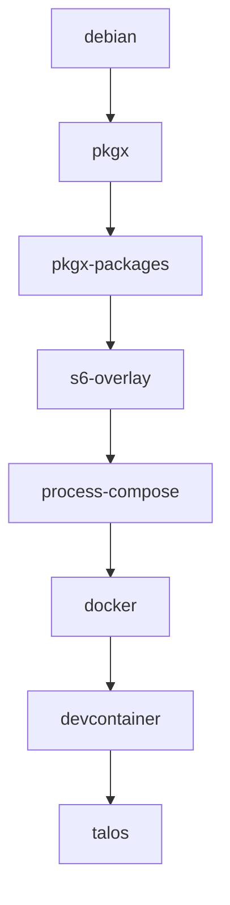

Open this repository in a GitHub Codespace with a click on the badge below.

```sh { background=false }
echo hello
```

[](https://github.com/codespaces/new?hide_repo_select=true&ref=main&repo=1051278938&skip_quickstart=true&machine=standardLinux32gb&devcontainer_path=.devcontainer%2Ftalos%2Fdevcontainer.json&geo=EuropeWest)

## Build Order

